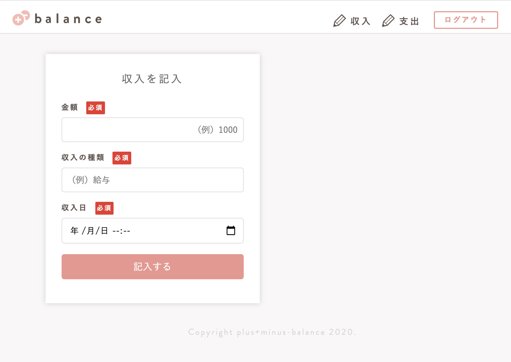

# README

# アプリケーション名
plus+minus-balance

# アプリケーション概要
- 1ヶ月でどのくらい支出をしているか
- 収入と支出を一画面で見ることができる
- 支出は変動費と固定費の集計を分けて見られる

### 開発予定
支出一覧・収入一覧・金額の編集及び削除機能
支出のカテゴリーを色で分けたグラフが見られる
目標を設定したら、目標を踏まえたグラフが表示される

# URL
デプロイ前

# テスト用アカウント

Basic認証
- id: admin
- pass: 2222

アカウント
- mail: ttt@ttt
- pass: 111qqq

# 利用方法
1. アカウント登録
2. topページにある "家計簿を作る" から新規の家計簿を作成
3. 収入の入力フォームで "金額","内容","日付" を入力
4. 支出の入力フォームで "金額","カテゴリー","日付","メモ" を入力
5. 入力後に出てくるダッシュボードページで収支を確認

# 目指した課題解決
金銭管理に苦手意識はあるけど、貯金もしていきたい方に向けて
支出の中でも、節約しやすい変動費について詳しく数値化し
何にどのくらいのコストがかかっているか意識させるアプリを目指しました

# 洗い出した要件
## 機能
- ユーザー管理機能
## 目的
- ユーザーの情報のセキュリティーのため
## 詳細
- 複数条件を指定した上で家計簿へのアクセスを許可する
## ストーリー(ユースケース)
- 複数のユーザーが使用する前提
- ベーシック認証

## 機能
- 収支ダイジェスト機能
## 目的
- 簡単に金額の管理の流れが見られるページを作る
## 詳細
- 支出における変動費と固定費の合計金額、収入の合計金額、収入から支出を引いた金額などが見られる
## ストーリー(ユースケース)
- 1ページに特定の月の収支の流れが見られる

## 機能
- 支出入力フォーム
## 目的
- ユーザーが日々、簡単に入力できる支出フォーム
## 詳細
- 最低限の支出にまつわる情報入力を可能にする
## ストーリー(ユースケース)
- 支出金額/支出のカテゴリー/日にちなどを入力できるフォームを作る

## 機能
- 収入入力フォーム
## 目的
- ユーザーが簡単に入力できる収入フォーム
## 詳細
- 収入にまつわる情報入力を可能にする
## ストーリー(ユースケース)
- 収入金額/収入名/日にちなどを入力できるフォームを作る

## 実装した機能についてのGIFと説明
#### ユーザー管理機能（ベーシック認証あり）
アドレスを入力するとまず、ベーシック認証を尋ねられます

#### 新規ユーザー登録画面
新規ユーザーは、username、email、passwordを登録してから、家計簿に入ることができます。

#### トップ画面
トップ画面では、収入と支出を入力されるボタンを表示しています。

#### 支出入力フォーム
支出フォームでは、金額、支出の種類、日付、メモを記入できます。
全て記入をしたら、家計簿に反映されます。

### 収入入力フォーム
収入フォームでは、金額、収入の名目（自由記入）、日付を記入できます。
全て記入をしたら、家計簿に反映されます。

### ダッシュボード画面で収支一覧が見れる
支出は、カテゴリー内で変動費と固定費を分けています。
家賃をカテゴリーで選択した場合は、自動的に固定費の家賃の欄に金額が反映され、カフェをカテゴリーで選択した場合は、自動的に変動費のカフェの欄に金額が反映されます。
節約の余地が少ない「固定費」と節約の余地のある「変動費」の数字を別の枠で見ることで、今後の支出について検討することができます。

## 実装予定の機能

## 機能
- 支出一覧
### 目的
- 支出を登録順に確認するため
### 詳細
- 支出の入力フォームで記入した内容が全て揃ったデータを一覧できる
### ストーリー(ユースケース)
- 支出一覧ボタンから支出一覧に飛べる

## 機能
- 収入一覧
### 目的
- 収入を登録順に確認するため
### 詳細
- 収入の入力フォームで記入した内容が全て揃ったデータを一覧できる
### ストーリー(ユースケース)
- 収入一覧ボタンから収入一覧に飛べる

## 機能
- 削除機能
### 目的
- 間違えて登録した場合の補助として
### 詳細
- 間違えて登録した場合に削除ができる
### ストーリー(ユースケース)
- 削除ボタンを押すと該当の情報が消せる

## 機能
- 編集機能
### 目的
- 間違えて登録した場合の補助として
### 詳細
- 間違えて登録した場合に編集ができる
### ストーリー(ユースケース)
- 編集ボタンを押すと該当の情報の編集ができる

## 機能
- 変動費グラフ機能
### 目的
- 節約を目的とした見える化として
### 詳細
- 節約できるポイントの変動費の割合をビジュアルで実感するため
### ストーリー(ユースケース)
- 変動費の目標の値を設定できる
- 今現在目標の値からどのくらい差があるかグラフを見て感じられる

## 機能
- 変動費・予算設定機能
### 目的
- 予算を数値化し、グラフで割合を見るため
### 詳細
- 予算と、変動費の詳細の割合が見られる
### ストーリー(ユースケース)
- 予算を設定したら、割合に対してのグラフがレンダリングされる

## 機能
- メモ機能
### 目的
- 振り返りのため
### 詳細
- 今月の収支を踏まえ、来月への節約メモが残せる
### ストーリー(ユースケース)
- メモボタンからメモの記入ができる
- 次の月にメモを残せる

## データベース設計
https://gyazo.com/7bae9907bd659a2654d3794a7edc715c

## ローカルでの動作方法
Ruby ver.6.0.0使用

git clone https://github.com/m-tatsuyama/in_ex_21.git

## users テーブル

| Column             | Type   | Options     |
| ------------------ | ------ | ----------- |
| username           | string | null: false |
| email              | string | null: false |
| password           | string | null: false |

### Association

- has_many :incomes
- has_many :expenses

## incomes テーブル 

| Column      | Type       | Options                        |
| ------------| ---------- | ------------------------------ |
| user        | references | null: false, foreign_key: true |
| about_in    | string     | null: false                    |
| in_amount   | string     | null: false                    |
| month       | integer    | null: false                    |

### Association

- belongs_to :user

## expenses テーブル

| Column       | Type       | Options                        |
| -------------| ---------- | ------------------------------ |
| user         | references | null: false, foreign_key: true |
| ex_amount    | integer    | null: false                    |
| about_ex     | string     | null: false                    |
| month        | integer    | null: false                    |

### Association

- belongs_to :user